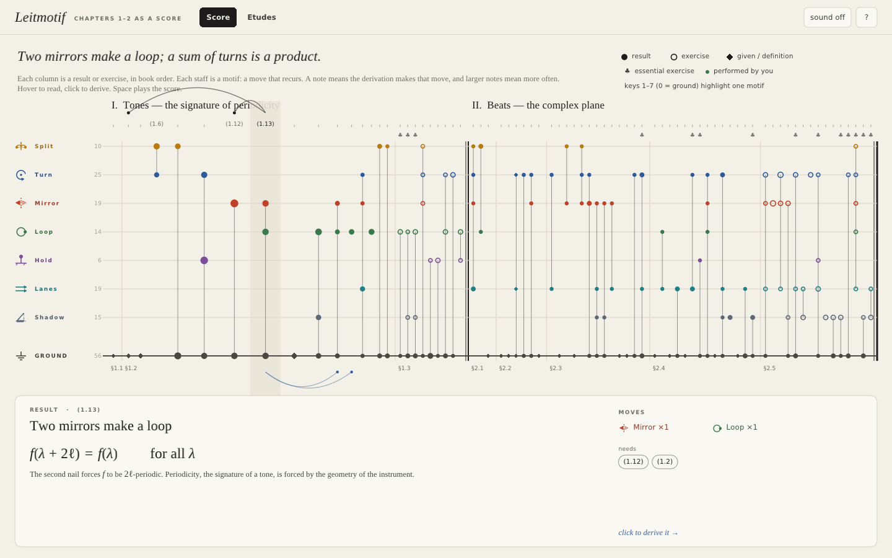
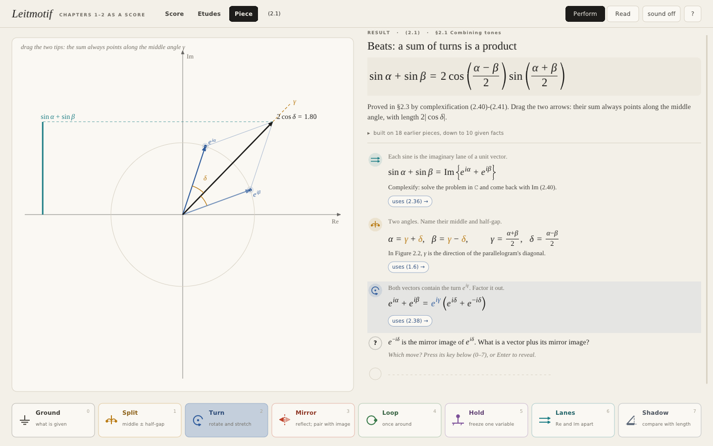
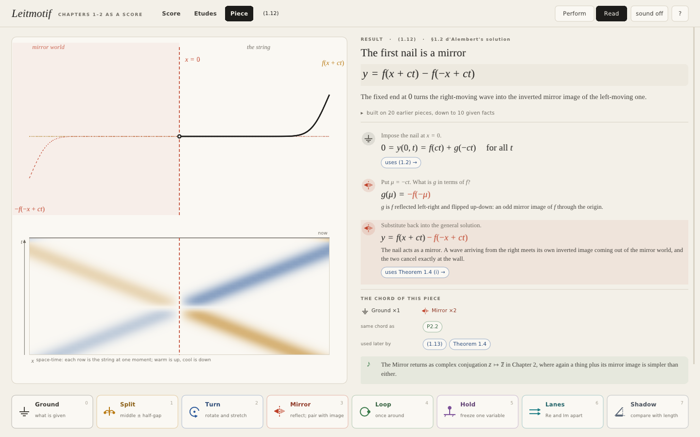

# Leitmotif: Chapters 1–2 as a score

A native desktop tool, written in C, for working with the first two chapters of the harmonic-analysis text: *Tones in Music: Signature of Periodicity* and *Beats in Music and the Complex Plane*. It assumes you have already read them.



## The idea

Both chapters keep making the same few moves. The tool names them and treats them as **motifs**, the recurring themes of a piece of music. Each motif has its own glyph, colour and pitch:

| | Motif | The move | Where it lives |
|---|---|---|---|
| ⏚ | **Ground** | use what is given: a definition, the physics, calculus | (1.1), (1.2), Clairaut, FTC, (2.12) |
| ⋔ | **Split** | write a pair as *middle ± half-gap* | $u=x+ct,\ v=x-ct$; $\gamma,\delta$ in beats; $\Re z=\frac{z+\bar z}{2}$; the half-angle in 2.11 |
| ↻ | **Turn** | multiply by $re^{i\theta}$; angles add | sum-angle formulas, (2.38), $i^2=-1$, polarisation, and even d'Alembert's coordinates: $v+iu=(1+i)(x+ict)$ |
| ⇋ | **Mirror** | reflect, then pair a thing with its image | the nails of the string, $\bar z$, $z\bar z=|z|^2$, $e^{i\delta}+e^{-i\delta}$ |
| ○ | **Loop** | go once around: periodicity, whole turns | two mirrors make a loop (1.13), harmonics, orthonormality, the period group |
| ⊥ | **Hold** | freeze one variable | $\partial_u(\partial_v y)=0$, separation of variables, the finger on the string |
| ⇉ | **Lanes** | work in Re and Im separately | complexification, calculus and convergence in $\mathbb C$ |
| ◺ | **Shadow** | compare a projection with a length | $\Re w\le|w|$: the triangle inequality, the integral estimate, M-L |

Every result and every exercise (76 pieces, about 200 steps) is written as a short **phrase of these moves**. Once the derivations are written that way, three things follow from the structure itself:

1. **The bigger picture.** The **Score** view shows both chapters at once. Columns are results and exercises in book order; staves are motifs. You can see where a theme recurs: the Mirror of the nails in Chapter 1 comes back as complex conjugation, and the Split of d'Alembert's coordinates comes back in beats and in the Dirichlet sum. Hover a column to see what it needs (arcs above) and what later uses it (arcs below). A fisheye lens magnifies around the cursor. The panel at the bottom sums up both chapters in three lines: the standing wave, beats, and the one picture behind both (a turn times a mirror pair).
2. **Deriving any formula from scratch.** In a **Piece** you meet each step's *cue* (the question you would ask yourself) and in **Perform** mode you name the move on the motif keyboard before the step is revealed. A wrong guess explains what that motif would have done and asks the right question instead. Every step that leans on an earlier result links to it, and each piece lists its whole lineage down to the given facts. So any formula can be rebuilt from the ground up.
3. **The exercises make sense.** Each exercise is a piece too, with the same moves, so you can see that Problem 2.11(b) is the beats identity again, Problem 1.3(a) is the Hold step of Theorem 1.4, and Problem 2.4 is a Mirror then a Shadow. Each finished piece lists the other pieces that share its chord. Misprints in the source are corrected and flagged (Lemma 1.1's sign, the missing $c$ in 1.3(c), the arctan quadrant in 1.3(d), FTC-1's missing $i$, $\sin(2\pi ikt)$ in (2.77), the oscillation in (2.78)).

One **stage**, a single plane, is used for every picture, in the same visual language: mirror images in vermilion, turns in blue, middles and half-gaps in ochre, and so on. The string scenes include a space-time panel where you can watch a wave reflect off a nail and come back inverted. You can drag points, use the slider, and hear the beats and harmonics.



The **Études** view takes one motif at a time: its canonical picture, the question that summons it, and every place it is used across both chapters.



There is also sound. Each motif is one harmonic of the Chapter 1 string (Ground is the fundamental, Shadow the 8th), so every piece has a chord. Press Space on the score to hear the two chapters played column by column.

## Controls

| | |
|---|---|
| Hover / click a column | read it / open it |
| Hover / click a staff label | the motif / its étude |
| Space (score) | play the score |
| 1–7, 0 (score) | highlight one motif (0 = ground) |
| 0–7 (piece) | Perform: name the next move. Read: jump to the next use of that motif |
| Enter | reveal the current step |
| ← → | walk through revealed steps |
| Tab | Perform / Read |
| Backspace, Esc | back along the breadcrumb |
| ? | help |

If anything goes wrong on Windows, a log is written to `%TEMP%\leitmotif-log.txt`, and a crash shows a dialog naming that file.

Your Perform progress is saved to `%APPDATA%\leitmotif-progress.txt` (Windows) or `~/.leitmotif-progress` (Linux).

## Run / build

**Windows:** `bin/Leitmotif.exe` is a self-contained 64-bit binary (about 400 KB). It only needs system DLLs (opengl32, gdi32, user32, winmm, msvcrt). Because it is unsigned, SmartScreen may ask: choose *More info → Run anyway*. To build it yourself, run `build.bat` (MSVC or MinGW-w64).

**Linux:**

```sh
make            # ./leitmotif (needs libx11-dev, libgl-dev; sound via ALSA if present)
make windows    # bin/Leitmotif.exe with x86_64-w64-mingw32-gcc
make selftest   # drives every view, piece and étude under Xvfb, writes screenshots to shots/
make debug      # AddressSanitizer + UBSan build
```

The self-test checks that every cross-reference resolves, that every formula parses, that no piece id repeats, and that no heap memory is still allocated at exit.

## How it is made

Plain C99 with OpenGL 1.1 and nothing else besides `stb_truetype`:

- `content.c`: the two chapters as data: motifs, sections, and 76 pieces with their steps.
- `tex.c`: a small TeX-like math typesetter (fractions, scripts, big operators, stretchy delimiters, column vectors, braces, motif colouring) and rich text with inline `$math$`.
- `stage.c`: the scenes: string and mirror worlds, space-time, standing waves and harmonics, periods, phasors and beats, the complex plane operations, exponentials, winding, polarisation, Riemann sums, separation of variables, lanes, and the études.
- `app.c`: Score, Piece, Études, Perform logic, help and self-test.
- `synth.c`: additive synth; `font.c`: the font atlas with fallback chains; `draw.c`: anti-aliased 2D primitives and the motif glyphs.
- `platform_win32.c` / `platform_x11.c`: window, input, audio (waveOut / ALSA via dlopen).
